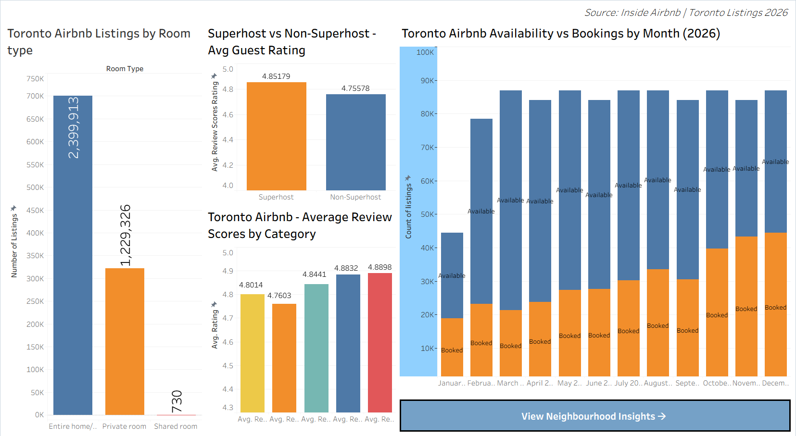
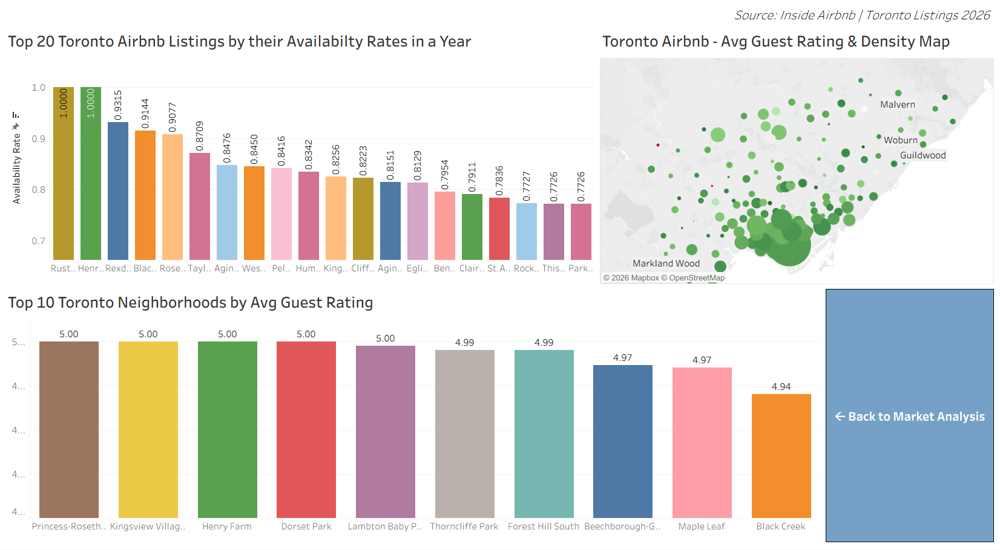

# 📊 Toronto Airbnb Market Analysis (2026)

An interactive two-dashboard Tableau analysis of **Toronto Airbnb listings (2026)**, exploring room type distribution, neighbourhood performance, host quality, booking seasonality, and availability trends.

> 🔗 **[View the live dashboard on Tableau Public →](https://public.tableau.com/app/profile/kazura.kenzo/viz/TorontoAirbnbMarketAnalysisOverview/Dashboard1_1?publish=yes)**

*Data source: Inside Airbnb | Toronto Listings 2026*

---

## 📈 Dashboard 1 - Market Analysis Overview

**Toronto Airbnb Listings by Room Type**
- Entire homes/apartments dominate at **2,399,913 listings**
- Private rooms account for **1,229,326 listings**
- Shared rooms are rare at just **730 listings**

**Superhost vs Non-Superhost Quality**
- Superhosts average a **4.85** guest rating vs **4.76** for non-superhosts - a consistent quality gap

**Average Review Scores by Category**
- Scores range tightly between **4.76 - 4.89** across all review categories
- Check-in and communication scores lead slightly at **4.88** and **4.89**

**Availability vs Bookings by Month (2026)**
- Bookings remain low in **January** (~20K) and climb through spring and summer
- Peak booking months are **October–December**, each reaching ~45K booked listings
- Available (unbooked) listings stay consistently high at **80K–90K** throughout the year, suggesting significant unmet supply

---

## 📈 Dashboard 2 - Neighbourhood Insights

**Top 20 Listings by Availability Rate**
- The highest-availability listings sit at a **100% availability rate**, concentrated in outer neighbourhoods like Ruscica and Henry Farm
- Most top-20 listings maintain availability rates between **77–93%**, indicating low booking conversion despite high listing counts

**Top 10 Neighbourhoods by Avg Guest Rating**
- **Princess-Rosethorn, Kingsview Village, Henry Farm, Dorset Park, and Lambton Baby Point** all achieve a perfect **5.00** average rating
- **Thorncliffe Park** and **Forest Hill South** follow at **4.99**
- **Beechborough-Greenbrook** and **Maple Leaf** rate at **4.97**
- **Black Creek** rounds out the top 10 at **4.94**

**Avg Guest Rating & Density Map**
- Listing density is heavily concentrated in central and east Toronto
- Markland Wood shows the largest bubble on the density map - highest listing concentration relative to its area
- Malvern, Woburn, and Guildwood show notable clusters in the east end

---

## 💡 Key Takeaways

- **Supply far outpaces bookings** - available listings consistently outnumber booked ones 2:1 or more, especially mid-year
- **Entire homes dominate** the market (~66% of all listings)
- **Outer neighbourhoods** tend to have higher guest ratings but lower booking rates - a potential opportunity for hosts willing to compete on quality
- **Superhosts meaningfully outperform** on ratings, validating the Superhost program as a quality signal
- **Booking demand peaks in Q4** (Oct–Dec), not summer - counter-intuitive for a cold-weather city

---

## Files

| File | Description |
|------|-------------|
| `Toronto Airbnb Market Analysis Overview.twbx` | Tableau packaged workbook - includes both dashboards + embedded data. Open with [Tableau Public (free)](https://public.tableau.com/en-us/s/download) or Tableau Desktop |

> **To open locally:** Download the `.twbx` file and open it in [Tableau Public (free)](https://public.tableau.com/en-us/s/download) or Tableau Desktop.

---

## Tools

---

## Context

Built as a data analytics project. Dataset sourced from publicly available Airbnb listing data for Toronto (Inside Airbnb, 2026).
